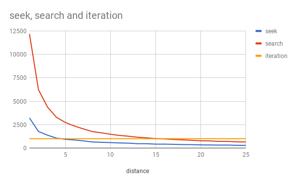

# normalized-index

an database index for flumedb that only stores sequence/offset.
It's a [Log Structured Merge-tree](https://en.wikipedia.org/wiki/Log-structured_merge-tree)
except it doesn't store keys, only pointers to the values which
are stored in the main flumelog.

This means that sorted data is fixed width, so is easy to binary
search. And most importantly, it means the indexes are very small.
If a 32 bit offset is used (for databases up to 4 gb) then an index
for a million records is only 4 mb, on the other hand, the size of a
denormalized LSM will depend on key size. Compound indexes (with more
than one key) are even more expensive for a denormalized index,
but the same cost for a normalized index.

The advantage of small indexes is that it becomes cheap to have
many indexes, 10-for-the-price-of-one.
This being a significant advantage for ad-hoc queries.

## motivation

This was the original idea that inspired [flumedb](https://github.com/flumedb)

## notes

This design uses simple binary search on top of sorted pointer arrays indexes.
(aka, normalized-indexes) and then merges those, a la LSM trees.
So far I'm just using a simple binary search, and to merge,
using a slightly clever approach that merges really fast if there
are runs in the merge. If we are merging A and B, say we take ~N
from A and then ~M from B, this gets faster as N and M are bigger
as they get nearer to 1 it becomes just like merging two streams.

To improve this, I realized that you do not need to do a whole
binary search each time. In fact, if you have arrived at a current
result from a binary search then it _implies_ that certain other
records have already been looked at, since the indexes examined
in a binary search are deterministic. Theifore, to search for
the next value, we can rewind the binary search to the place
that it would have diverted - if the next value we are seeking
is only slightly greater than the current, the same path would be
followed, until somewhere near the end. So, rewind and continue
searching from that state. Also, since we read them recently,
these values will already be in the cache! so reading them will be
very fast.

This improves read efficiency significantly! In an experiment
where the first record in an index is read, then records at
varying distances, the number of reads used is graphed, depending
on wether another full binary search is used, or reversing the search
then searching, or just iterating over the dataset.

The bottom axis is the average distance we want to jump ahead.
Iteration always costs the same because it just reads everything,
giving us a lower bound. Seek and Search are both worse than
simple iteration at low numbers, but Seek becomes better if the
average distance jumped is 5, but but search doesn't become better
than iteration until the average is 15!

Seeking is definitely effective, but it's also necessary to switch
to iteration if the average distance jumped is too low.
Probably a rule of thumb is sufficient in practice, because
the real world performance is probably related to application
factors.

## License

MIT

